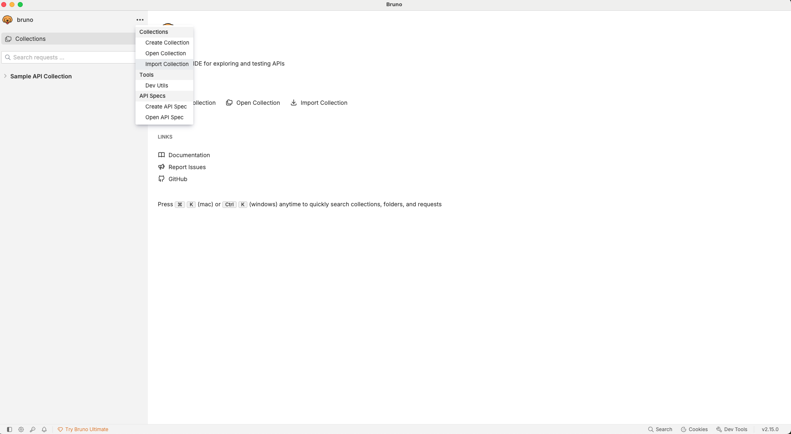
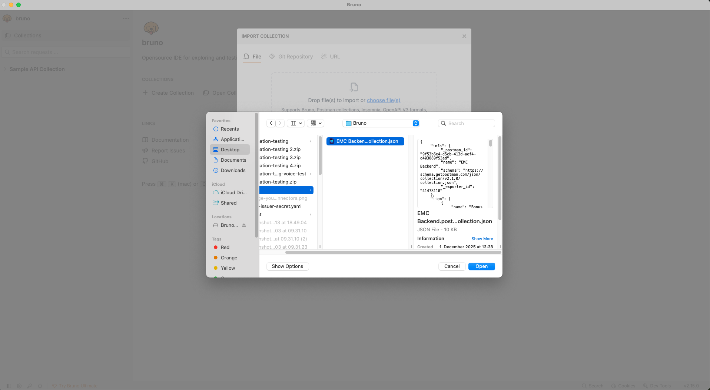
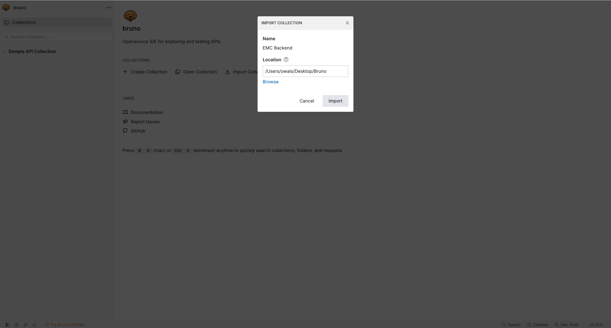
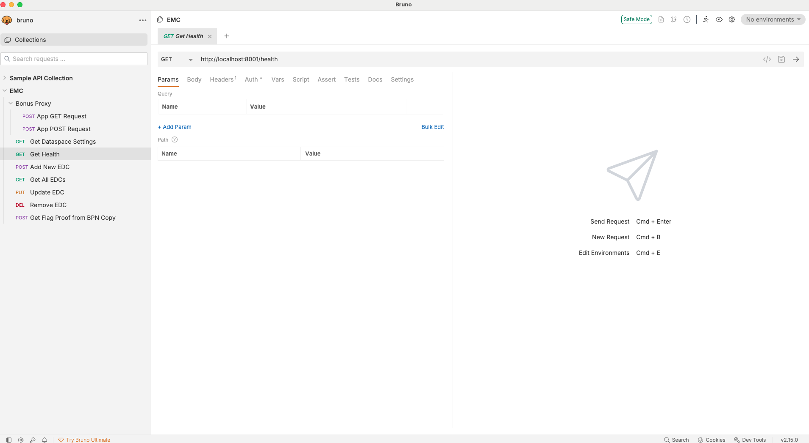

# EDC Management Console (EMC)
## Bruno Collection Setup Guide 

### 1. Overview 

This document explains how to prepare and use Bruno collections for the EMC application. It is intended for developers working with EMC APIs. 
The EMC (EDC Management Console) application exposes several backend APIs. This guide helps set up the Bruno collection by importing the provided Postman collection: 
-   You can find the collection here :
[EMC API Collection](<emc-collection/EMC Backend.postman_collection.json>)

### 2. Prerequisites 
Before setting up the Bruno collection, ensure you have: 

-   Bruno installed on your machine 
-   Download from: https://www.usebruno.com/ 
-   Access to EMC application environment (dev/test/stage) 
-   Required API base URLs 
-   Authentication/authorization credentials (e.g., API keys, tokens) 

### 3. Import the EMC Bruno Collection 
Bruno has a built‑in importer to convert Postman collections. 

#### Steps to Import: 

-   In the left panel, click the three dots (…) next to the Workspace name. 
-   Select Import Collection. 

-   Choose the file: EMC Backend.postman_collection.json 
-   Bruno will automatically generate a .bru folder structure.

- Click on Import button

### 4. Verify Imported Structure 

- After import, you will see folders such as:
- Bonus Proxy
- Dataspace Settings
- Health
- EDC CRUD Requests
    - Add
    - Get All
    - Update
    - Remove
- Flags Proof
- Each request will contain:
    - HTTP Method (GET / POST / PUT / DELETE)
    - URL
    - Request Body (if applicable)
    - Headers
    - API Key authenticatio

5. Configure Environment Variables

 1. Go to Environments in Bruno.
 2. Add a new environment (e.g., EMC Dev, EMC Test).
 3.  Configure the following variables:
- base_url → https://your-emc-env-url
- api_key → your-api-key
- dd any additional headers or tokens required by EMC APIs

### 6. Running APIs in Bruno

1. Open the imported EMC collection.
2. Select the API request you want to run.
3. Choose the environment you configured.
4. Click Send
5. Check the response panel for results.
