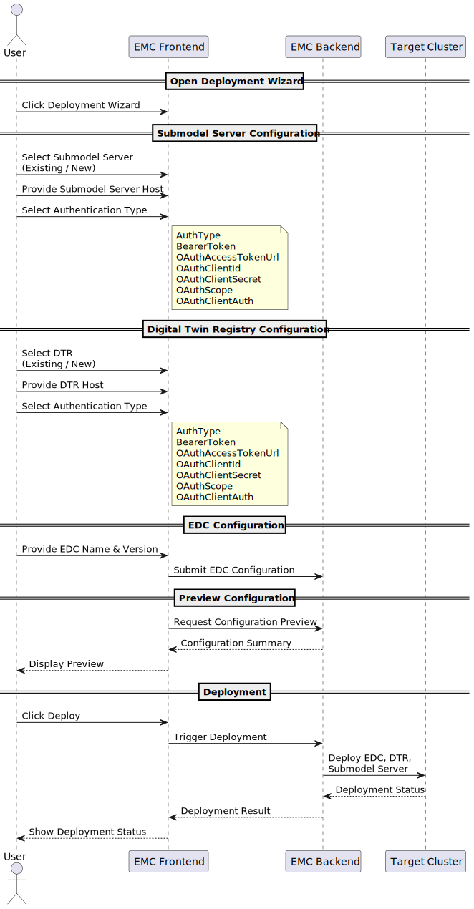
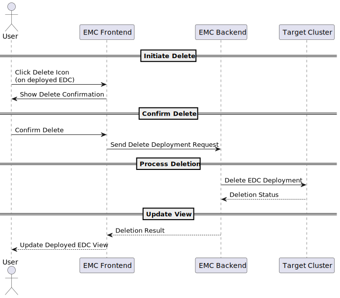

# Runtime View

The runtime view mainly focuses on the following scenarios:
- Deploy a new EDC, optionally along with a Digital Twin Registry (DTR) and Submodel Server
- Update EDC deployment
- Delete EDC deployment

## Scenario:
User clicks the deployment wizard
- Submodel Server
 - User has the provision to use an existing submodel server or create a new one
 - User provides the host name of the submodel server (existing or new one)
 - User specifies the authentication mechanism for the submodel server 
```ts
AuthType
BearerToken
OAuthAccessTokenUrl 
OAuthClientId
OAuthClientSecret 
OAuthScope
OAuthClientAuth
```
- Digital Twin Registry (DTR)
 - User has the provision to use an existing DTR or create a new one
 - User provides the host name of the DTR
 - User chooses the authentication mechanism for the DTR
```
AuthType
BearerToken
OAuthAccessTokenUrl 
OAuthClientId
OAuthClientSecret 
OAuthScope
OAuthClientAuth
```
- Eclipse DataSpace Connector
 - User provides details such as name of the edc, connector version
- Preview the configurations
- Click on the deploy button to deploy the configuration on the cluster



## Scenario:
_To be implemented_


## Scenario
To delete an EDC deployment
- User clicks on the delete icon on the deployed EDC view
- User confirms on the delete request
- The request is then processed on the backend and the deployment in the cluster is brought down
- The View is updated accordingly



## NOTICE

This work is licensed under the [Apache-2.0](https://www.apache.org/licenses/LICENSE-2.0).

- Copyright (c) 2025 ARENA2036 e.V.
- SPDX-License-Identifier: Apache-2.0
- SPDX-FileCopyrightText: 2024 Contributors to the Eclipse Foundation
- Source URL: https://github.com/eclipse-tractusx/puris
