# Deployment View

## Local Deployment
Local deployment requires the backend to be configured to deploy a local cluster (minikube). This process is not yet tested.

## Kubernetes Deployment
The very basic EMC application deployment model looks as follows:

The keycloak may be configured to be used. Also, a decentral instance may be connected to the frontend.

The chart allows also to either install the database as a dependency or bring your own.

## NOTICE

This work is licensed under the [CC-BY-4.0](https://creativecommons.org/licenses/by/4.0/legalcode).

- Copyright (c) 2025 ARENA2036 e.V.
- SPDX-License-Identifier: CC-BY-4.0
- SPDX-FileCopyrightText: 2024 Contributors to the Eclipse Foundation
- Source URL: https://github.com/eclipse-tractusx/edc-management-console
