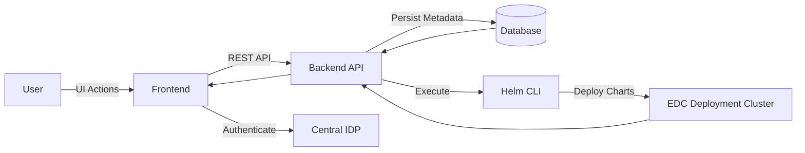

```mermaid
flowchart LR
    User[User]
    Frontend[Frontend]
    Backend[Backend API]
    DB[(Database)]
    Helm[Helm CLI]
    EDCCluster[EDC Deployment Cluster]
    IDP[Central IDP]

    User -->|UI Actions| Frontend
    Frontend -->|REST API| Backend
    Frontend -->|Authenticate| IDP
    Backend -->|Persist Metadata| DB
    Backend -->|Execute| Helm
    Backend --> Frontend
    
    DB --> Backend
    Helm -->|Deploy Charts| EDCCluster

    EDCCluster --> Backend
```