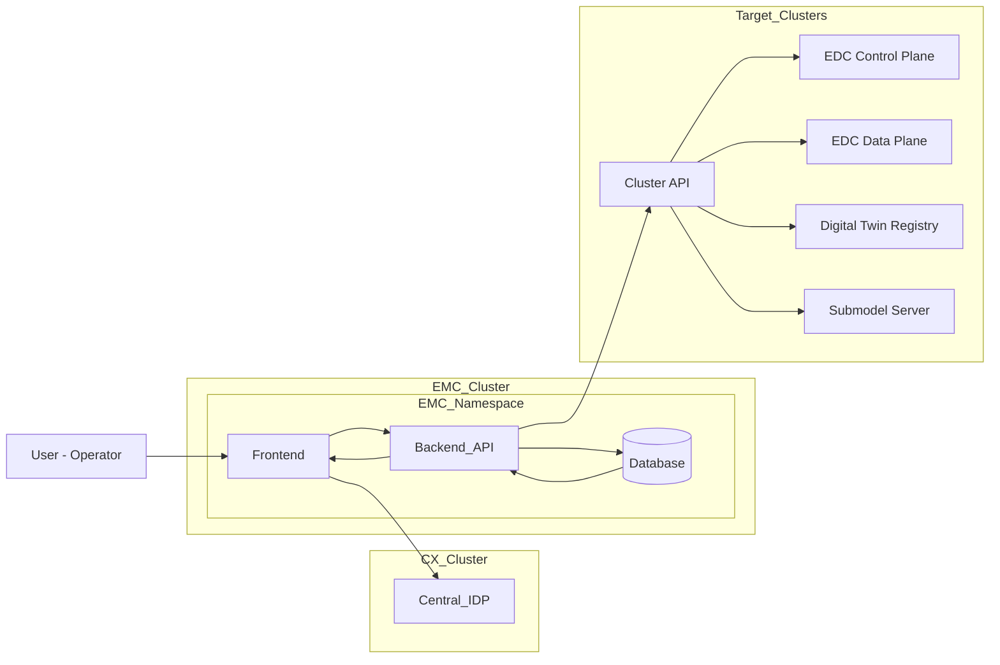

```mermaid
flowchart LR
    User[User - Operator]

    subgraph CX_Cluster
        IDP[Central_IDP]
    end

    subgraph EMC_Cluster
        subgraph EMC_Namespace
            FE[Frontend]
            BE[Backend_API]
            DB[(Database)]
            FE --> BE
            BE --> DB
            DB --> BE
            BE --> FE
        end
    end

    %% Target Clusters
    subgraph Target_Clusters
        ClusterAPI[Cluster API]
        EDC1[EDC Control Plane]
        EDC2[EDC Data Plane]
        DTR[Digital Twin Registry]
        SBS[Submodel Server]
        ClusterAPI --> EDC1
        ClusterAPI --> EDC2
        ClusterAPI --> DTR
        ClusterAPI --> SBS
    end

    %% Connections
    User --> FE
    FE --> IDP
    BE --> ClusterAPI
    


```