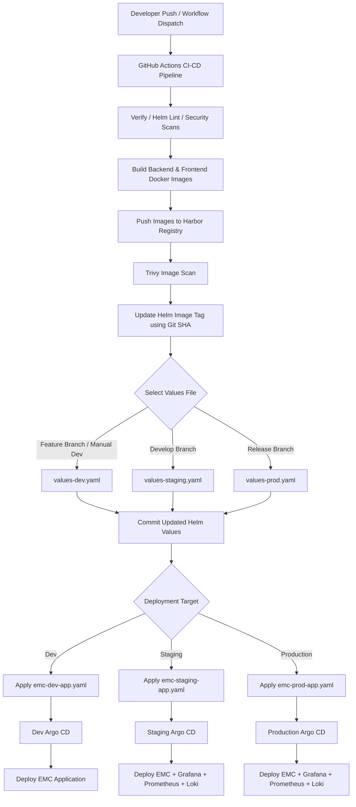

# EMC CI/CD Flow

```mermaid
flowchart TD

     A[Developer Push / Workflow Dispatch] --> B[GitHub Actions CI-CD Pipeline]

    B --> C[Verify / Helm Lint / Security Scans]

    C --> D[Build Backend & Frontend Docker Images]

    D --> E[Push Images to Harbor Registry]

    E --> F[Trivy Image Scan]

    F --> G[Update Helm Image Tag using Git SHA]

    G --> H{Select Values File}

    H -->|Feature Branch / Manual Dev| H1[values-dev.yaml]
    H -->|Develop Branch| H2[values-staging.yaml]
    H -->|Release Branch| H3[values-prod.yaml]

    H1 --> I[Commit Updated Helm Values]
    H2 --> I
    H3 --> I

    I --> J{Deployment Target}

    J -->|Dev| K[Apply emc-dev-app.yaml]
    J -->|Staging| L[Apply emc-staging-app.yaml]
    J -->|Production| M[Apply emc-prod-app.yaml]

    K --> N[Dev Argo CD]
    L --> O[Staging Argo CD]
    M --> P[Production Argo CD]

    N --> Q[Deploy EMC Application]

    O --> R[Deploy EMC + Grafana + Prometheus + Loki]

    P --> S[Deploy EMC + Grafana + Prometheus + Loki]
```