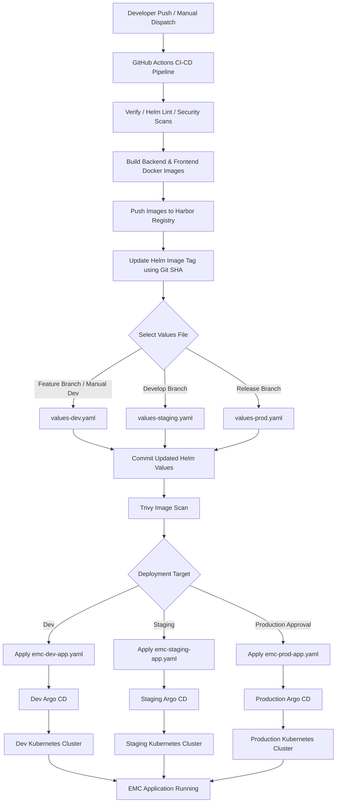

```mermaid
flowchart TD

    A[Developer Push / Manual Dispatch] --> B[GitHub Actions CI-CD Pipeline]

    B --> C[Verify / Helm Lint / Security Scans]

    C --> D[Build Backend & Frontend Docker Images]

    D --> E[Push Images to Harbor Registry]

    E --> F[Update Helm Image Tag using Git SHA]

    F --> G{Select Values File}

    G -->|Feature Branch / Manual Dev| G1[values-dev.yaml]
    G -->|Develop Branch| G2[values-staging.yaml]
    G -->|Release Branch| G3[values-prod.yaml]

    G1 --> H[Commit Updated Helm Values]
    G2 --> H
    G3 --> H

    H --> I[Trivy Image Scan]

    I --> J{Deployment Target}

    J -->|Dev| K[Apply emc-dev-app.yaml]
    J -->|Staging| L[Apply emc-staging-app.yaml]
    J -->|Production Approval| M[Apply emc-prod-app.yaml]

    K --> N[Dev Argo CD]
    L --> O[Staging Argo CD]
    M --> P[Production Argo CD]

    N --> Q[Dev Kubernetes Cluster]
    O --> R[Staging Kubernetes Cluster]
    P --> S[Production Kubernetes Cluster]

    Q --> T[EMC Application Running]
    R --> T
    S --> T
```