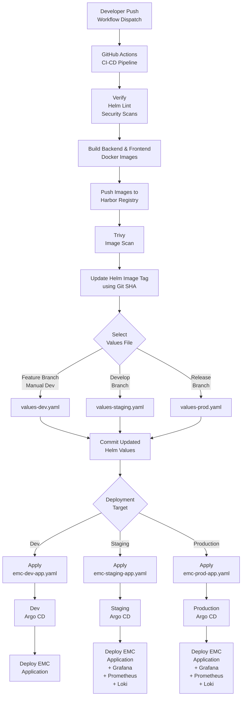

# EMC CI/CD Flow

```mermaid
flowchart TD

    A[Developer Push<br/>Workflow Dispatch] --> B[GitHub Actions<br/>CI-CD Pipeline]

    B --> C[Verify<br/>Helm Lint<br/>Security Scans]

    C --> D[Build Backend & Frontend<br/>Docker Images]

    D --> E[Push Images to<br/>Harbor Registry]

    E --> F[Trivy<br/>Image Scan]

    F --> G[Update Helm Image Tag<br/>using Git SHA]

    G --> H{Select<br/>Values File}

    H -->|Feature Branch<br/>Manual Dev| H1[values-dev.yaml]
    H -->|Develop<br/>Branch| H2[values-staging.yaml]
    H -->|Release<br/>Branch| H3[values-prod.yaml]

    H1 --> I[Commit Updated<br/>Helm Values]
    H2 --> I
    H3 --> I

    I --> J{Deployment<br/>Target}

    J -->|Dev| K[Apply<br/>emc-dev-app.yaml]
    J -->|Staging| L[Apply<br/>emc-staging-app.yaml]
    J -->|Production| M[Apply<br/>emc-prod-app.yaml]

    K --> N[Dev<br/>Argo CD]
    L --> O[Staging<br/>Argo CD]
    M --> P[Production<br/>Argo CD]

    N --> Q[Deploy EMC<br/>Application]

    O --> R[Deploy EMC<br/>Application<br/>+ Grafana<br/>+ Prometheus<br/>+ Loki]

    P --> S[Deploy EMC<br/>Application<br/>+ Grafana<br/>+ Prometheus<br/>+ Loki]
```