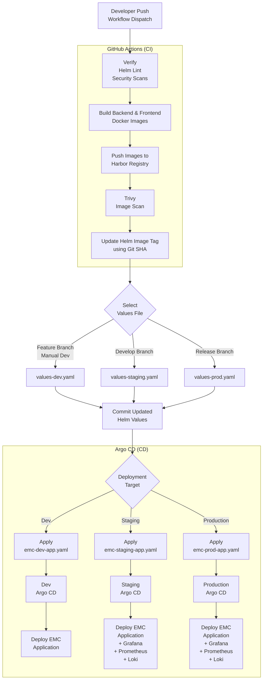

# EMC CI/CD Flow

```mermaid
flowchart TD

    A[Developer Push<br/>Workflow Dispatch]

    subgraph CI["GitHub Actions (CI)"]
        B[Verify<br/>Helm Lint<br/>Security Scans]
        C[Build Backend & Frontend<br/>Docker Images]
        D[Push Images to<br/>Harbor Registry]
        E[Trivy<br/>Image Scan]
        F[Update Helm Image Tag<br/>using Git SHA]

        B --> C
        C --> D
        D --> E
        E --> F
    end

    A --> B

    F --> G{Select<br/>Values File}

    G -->|Feature Branch<br/>Manual Dev| G1[values-dev.yaml]
    G -->|Develop Branch| G2[values-staging.yaml]
    G -->|Release Branch| G3[values-prod.yaml]

    G1 --> H[Commit Updated<br/>Helm Values]
    G2 --> H
    G3 --> H

    H --> I

    subgraph CD["Argo CD (CD)"]
        I{Deployment<br/>Target}

        I -->|Dev| J[Apply<br/>emc-dev-app.yaml]
        I -->|Staging| K[Apply<br/>emc-staging-app.yaml]
        I -->|Production| L[Apply<br/>emc-prod-app.yaml]

        J --> M[Dev<br/>Argo CD]
        K --> N[Staging<br/>Argo CD]
        L --> O[Production<br/>Argo CD]

        M --> P[Deploy EMC<br/>Application]

        N --> Q[Deploy EMC<br/>Application<br/>+ Grafana<br/>+ Prometheus<br/>+ Loki]

        O --> R[Deploy EMC<br/>Application<br/>+ Grafana<br/>+ Prometheus<br/>+ Loki]
    end
```