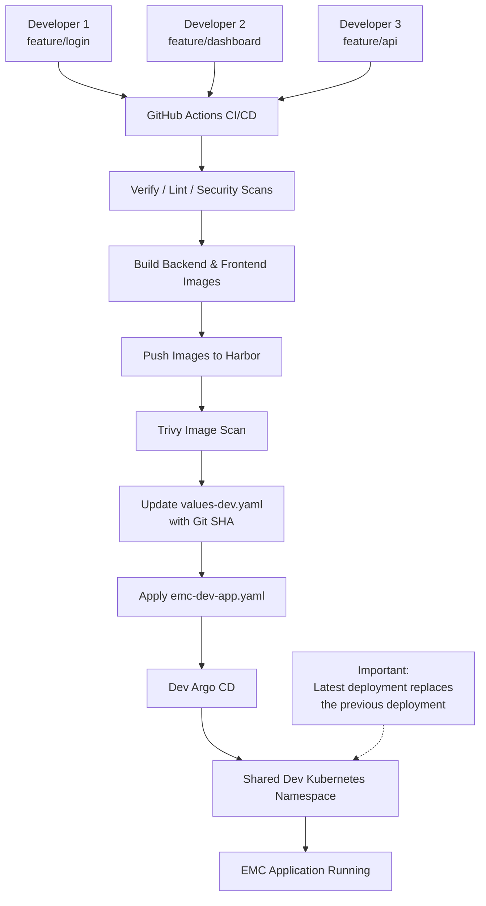

```mermaid
flowchart TD

    A[Developer 1<br/>feature/login] --> D[GitHub Actions CI/CD]
    B[Developer 2<br/>feature/dashboard] --> D
    C[Developer 3<br/>feature/api] --> D

    D --> E[Verify / Lint / Security Scans]
    E --> F[Build Backend & Frontend Images]
    F --> G[Push Images to Harbor]
    G --> H[Trivy Image Scan]
    H --> I[Update values-dev.yaml<br/>with Git SHA]
    I --> J[Apply emc-dev-app.yaml]
    J --> K[Dev Argo CD]
    K --> L[Shared Dev Kubernetes Namespace]
    L --> M[EMC Application Running]

    N[Important:<br/>Latest deployment replaces<br/>the previous deployment] -.-> L
```