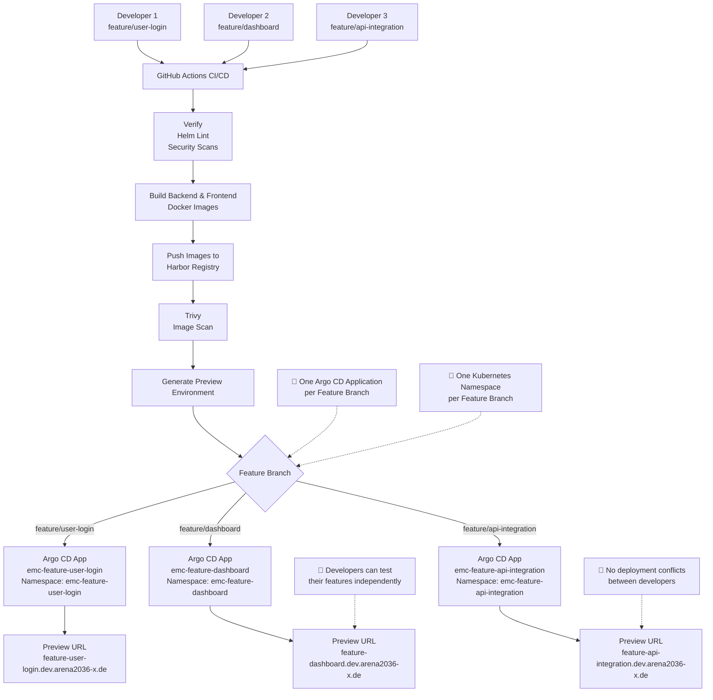

# Developer Preview Environment

## How It Works

1. A developer creates a feature branch (for example, `feature/user-login`).
2. GitHub Actions automatically starts the CI/CD pipeline.
3. The pipeline:
   - Verifies the code.
   - Runs Helm lint and security checks.
   - Builds backend and frontend Docker images.
   - Pushes the images to the Harbor registry.
   - Runs a Trivy vulnerability scan.
4. GitHub Actions generates a unique preview environment using the branch name.
5. A dedicated Argo CD Application and Kubernetes namespace are created.
6. Argo CD deploys the application into the new namespace.
7. The developer receives an isolated preview environment for testing.

## Deployment Example

| Developer | Feature Branch | Argo CD Application | Kubernetes Namespace |
|-----------|----------------|---------------------|----------------------|
| Developer 1 | `feature/user-login` | `emc-feature-user-login` | `emc-feature-user-login` |
| Developer 2 | `feature/dashboard` | `emc-feature-dashboard` | `emc-feature-dashboard` |
| Developer 3 | `feature/api-integration` | `emc-feature-api-integration` | `emc-feature-api-integration` |

## How the Deployment Works

The CI/CD pipeline **does not modify** `values-dev.yaml`.

Instead:

- `values-dev.yaml` provides the base development configuration.
- GitHub Actions generates branch-specific values.
- The generated Argo CD Application passes these values as Helm parameters.
- Helm combines the base configuration from `values-dev.yaml` with the branch-specific overrides during deployment.

Each deployment uses:

- A unique Argo CD Application
- A unique Kubernetes namespace
- A unique Helm release name
- A unique Docker image tag (Git SHA)
- A unique ingress host

## Benefits

- Isolated preview environment for every feature branch.
- Multiple developers can test their features simultaneously.
- No deployment conflicts between developers.
- The same Helm chart and `values-dev.yaml` are reused for every preview deployment.
- Staging and Production environments remain unaffected.