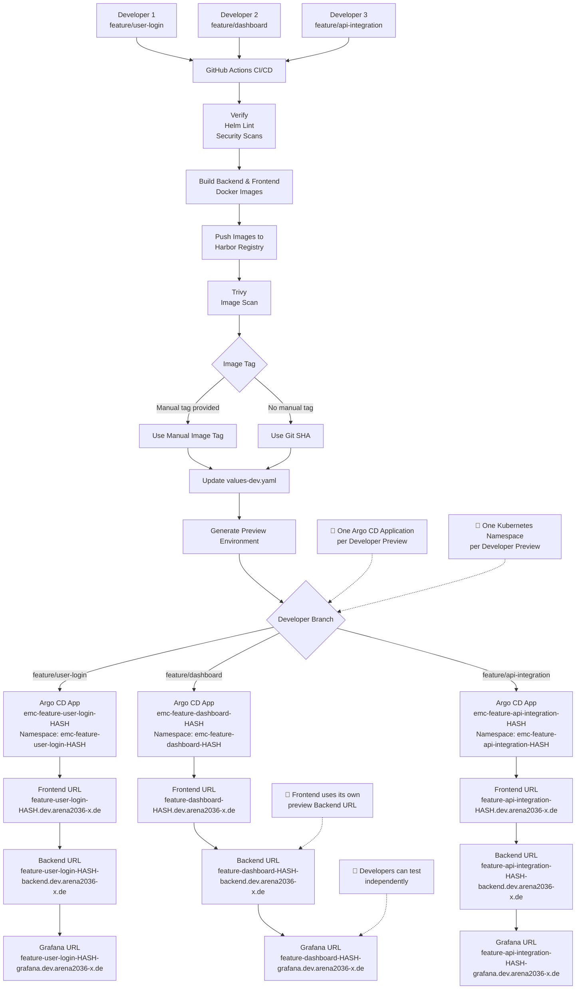

# Developer Preview Environment



## How It Works

1. A developer creates a branch such as `feature/user-login`, `bugfix/...`, or `hotfix/...`.
2. A push to the developer branch automatically starts the GitHub Actions CI/CD pipeline.
3. The pipeline:

   * Verifies the code.
   * Runs Helm lint and security checks.
   * Builds backend and frontend Docker images.
   * Pushes the images to the Harbor registry.
   * Runs a Trivy vulnerability scan.
4. The pipeline selects the Docker image tag:

   * If a manual `image_tag` is provided, that tag is used.
   * If no manual `image_tag` is provided, the current Git SHA is used automatically.
5. The backend and frontend image tags are updated in `values-dev.yaml`.
6. GitHub Actions generates a unique preview name using the branch name and a short branch hash.
7. A dedicated Argo CD Application and Kubernetes namespace are created.
8. Preview-specific Helm parameters override the base configuration from `values-dev.yaml`.
9. Argo CD deploys the preview environment to the AP6 development cluster.
10. The frontend uses the backend URL belonging to the same preview environment.
11. Grafana connects to the Prometheus and Loki services belonging to the same preview environment.

## Deployment Example

| Developer   | Feature Branch            | Argo CD Application                | Kubernetes Namespace               |
| ----------- | ------------------------- | ---------------------------------- | ---------------------------------- |
| Developer 1 | `feature/user-login`      | `emc-feature-user-login-HASH`      | `emc-feature-user-login-HASH`      |
| Developer 2 | `feature/dashboard`       | `emc-feature-dashboard-HASH`       | `emc-feature-dashboard-HASH`       |
| Developer 3 | `feature/api-integration` | `emc-feature-api-integration-HASH` | `emc-feature-api-integration-HASH` |

The short `HASH` is generated from the complete branch name. This helps prevent similarly named branches from using the same Argo CD Application or Kubernetes namespace.

## How the Deployment Works

The CI/CD pipeline uses `values-dev.yaml` as the base development configuration.

The selected image tag is:

* The manually provided `image_tag`, when one is provided.
* Otherwise, the current Git SHA.

For example:

```yaml
backend:
  image:
    tag: <manual-image-tag-or-git-sha>

frontend:
  image:
    tag: <manual-image-tag-or-git-sha>
```

GitHub Actions then generates the developer-specific Argo CD Application from:

```text
.github/argocd/emc-dev-preview-app.yaml
```

Helm combines `values-dev.yaml` with preview-specific Argo CD parameters.

Each developer preview receives:

* A unique Argo CD Application.
* A unique Kubernetes namespace.
* A unique Helm release name.
* A unique backend and frontend image tag.
* A unique frontend ingress host.
* A unique backend ingress host.
* A unique Grafana ingress host.
* A preview-specific frontend backend URL.
* Preview-specific Prometheus and Loki datasource URLs.

## Frontend and Backend Configuration

The frontend must communicate with the backend from the same preview environment.

For example:

```text
Preview:
emc-feature-user-login-451936f
```

Frontend:

```text
https://feature-user-login-451936f.dev.arena2036-x.de
```

Backend:

```text
https://feature-user-login-451936f-backend.dev.arena2036-x.de
```

The frontend configuration should therefore use the preview backend URL instead of the fixed shared backend URL.

Conceptually:

```text
Developer Preview Frontend
          ↓
VITE_BACKEND_URL
          ↓
Developer Preview Backend
```

This prevents a developer preview frontend from accidentally calling the shared Dev backend.

## Observability

Each preview environment has its own observability services.

For example:

```text
Prometheus:
emc-feature-user-login-451936f-prometheus-server

Loki:
emc-feature-user-login-451936f-loki-gateway

Grafana:
emc-feature-user-login-451936f-grafana
```

Grafana connects to:

```text
http://emc-feature-user-login-451936f-prometheus-server

http://emc-feature-user-login-451936f-loki-gateway
```

The Grafana dashboard sidecar also searches the preview namespace for dashboard ConfigMaps.

## Benefits

* Isolated preview environment for every developer branch.
* Supports `feature/*`, `bugfix/*`, and `hotfix/*`.
* Developer branches run automatically on push.
* Multiple developers can test simultaneously.
* No deployment conflicts between developers.
* Manual Docker image tag support.
* Git SHA is used automatically when no manual tag is provided.
* Frontend communicates with the correct preview backend.
* Unique frontend, backend, and Grafana endpoints.
* Each preview uses its own Prometheus and Loki services.
* The same Helm chart and `values-dev.yaml` are reused.
* Developer previews are deployed to the AP6 development cluster.
* Shared Dev and Production remain separate from developer preview deployments.
