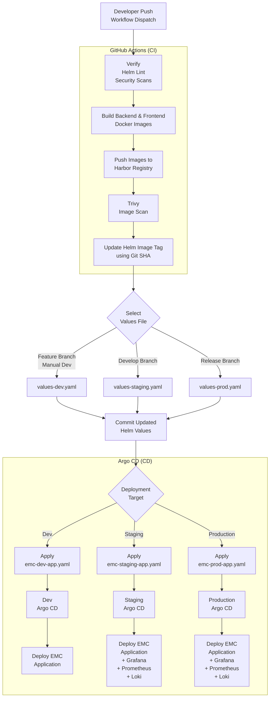

# EMC CI/CD Flow

## Overview

The EMC CI/CD pipeline automates the build, security scanning, and deployment of the EDC Management Console using GitHub Actions and Argo CD.

The pipeline is divided into two stages:

- **Continuous Integration (CI)** – GitHub Actions
- **Continuous Deployment (CD)** – Argo CD

---

## Continuous Integration (GitHub Actions)

When a developer pushes code or manually triggers the workflow, GitHub Actions performs the following steps:

1. Verify the project.
2. Run Helm lint and security checks.
3. Build backend and frontend Docker images.
4. Push the Docker images to the Harbor registry.
5. Scan the images using Trivy.
6. Update the Helm image tag using the current Git commit SHA.

---

## Environment Selection

After the images are built and scanned, the pipeline selects the appropriate Helm values file based on the branch.

| Branch | Values File | Environment |
|---------|-------------|-------------|
| Feature Branch / Manual Dev | `values-dev.yaml` | Development |
| `develop` | `values-staging.yaml` | Staging |
| Release Branch | `values-prod.yaml` | Production |

The updated Helm configuration is committed to the Git repository.

---

## Continuous Deployment (Argo CD)

Argo CD continuously monitors the Git repository.

When it detects a change, it synchronizes the Kubernetes cluster and deploys the application to the appropriate environment.

| Environment | Argo CD Application | Components |
|-------------|---------------------|------------|
| Development | `emc-dev-app.yaml` | EMC Application |
| Staging | `emc-staging-app.yaml` | EMC + Grafana + Prometheus + Loki |
| Production | `emc-prod-app.yaml` | EMC + Grafana + Prometheus + Loki |

---

## Deployment Flow

1. Developer pushes code or manually starts the workflow.
2. GitHub Actions builds and validates the application.
3. Docker images are pushed to Harbor.
4. Trivy scans the images for vulnerabilities.
5. The Helm image tag is updated using the Git SHA.
6. The appropriate values file is selected.
7. The Helm configuration is committed to Git.
8. Argo CD detects the change.
9. Argo CD synchronizes Kubernetes.
10. The application is deployed to the selected environment.

---

## Benefits

- Fully automated CI/CD pipeline.
- GitOps-based deployment using Argo CD.
- Automated Docker image build and publishing.
- Integrated Trivy security scanning.
- Environment-specific Helm configuration.
- Automatic synchronization with Kubernetes.
- Integrated observability stack (Grafana, Prometheus, and Loki) for Staging and Production.