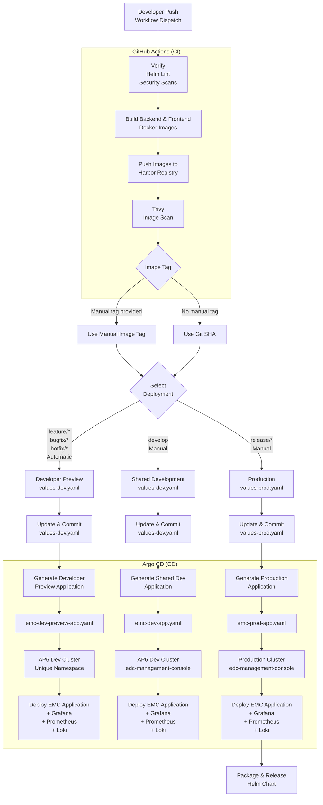

# EMC CI/CD Flow



## Overview

The EMC CI/CD pipeline automates the build, security scanning, and deployment of the EDC Management Console using GitHub Actions and Argo CD.

The pipeline is divided into two stages:

* **Continuous Integration (CI)** – GitHub Actions
* **Continuous Deployment (CD)** – Argo CD

Developer branches are built and deployed automatically.

Shared Development and Production deployments are started manually.

---

## Continuous Integration (GitHub Actions)

When a developer pushes code to a developer branch or manually triggers the workflow, GitHub Actions performs the following steps:

1. Verify the project.

2. Run Helm lint and security checks.

3. Build backend and frontend Docker images.

4. Push the Docker images to the Harbor registry.

5. Scan the images using Trivy.

6. Select the Docker image tag:

   * If a manual `image_tag` is provided, use the manual image tag.
   * If no manual `image_tag` is provided, use the current Git SHA.

7. Update the backend and frontend image tags in the appropriate Helm values file.

---

## Environment Selection

The pipeline selects the appropriate deployment based on the branch and workflow trigger.

| Branch                              | Trigger        | Values File        | Environment        |
| ----------------------------------- | -------------- | ------------------ | ------------------ |
| `feature/*`, `bugfix/*`, `hotfix/*` | Automatic Push | `values-dev.yaml`  | Developer Preview  |
| `develop`                           | Manual         | `values-dev.yaml`  | Shared Development |
| `release/*`                         | Manual         | `values-prod.yaml` | Production         |

For developer branches, the pipeline starts automatically when code is pushed.

For `develop`, the developer manually starts the workflow and selects:

```text
environment = dev
```

For `release/*`, the developer manually starts the workflow and selects:

```text
environment = prod
```

For manual deployments:

* If `image_tag` is provided, the pipeline uses the manual tag.
* If `image_tag` is not provided, the pipeline automatically uses the current Git SHA.

The updated Helm configuration is committed to the Git repository.

---

## Continuous Deployment (Argo CD)

Argo CD deploys the application using the appropriate Argo CD Application configuration.

| Environment        | Argo CD Application        | Components                        |
| ------------------ | -------------------------- | --------------------------------- |
| Developer Preview  | `emc-dev-preview-app.yaml` | EMC + Grafana + Prometheus + Loki |
| Shared Development | `emc-dev-app.yaml`         | EMC + Grafana + Prometheus + Loki |
| Production         | `emc-prod-app.yaml`        | EMC + Grafana + Prometheus + Loki |

Developer Preview and Shared Development environments are deployed to the **AP6 development cluster**.

Production is deployed to the **Production cluster**.

---

## Developer Preview Deployment

For developer branches such as:

```text
feature/*
bugfix/*
hotfix/*
```

the pipeline runs automatically when code is pushed.

GitHub Actions generates an isolated preview environment for every developer branch.

Each developer preview uses:

* A unique Argo CD Application.
* A unique Kubernetes namespace.
* A unique Helm release name.
* A unique frontend ingress host.
* A unique backend ingress host.
* A unique Grafana ingress host.
* A unique Docker image tag using the Git SHA.
* Preview-specific Prometheus and Loki services.

For example:

```text
Branch:
feature/user-login

Argo CD Application:
emc-feature-user-login-HASH

Kubernetes Namespace:
emc-feature-user-login-HASH

Frontend:
feature-user-login-HASH.dev.arena2036-x.de

Backend:
feature-user-login-HASH-backend.dev.arena2036-x.de

Grafana:
feature-user-login-HASH-grafana.dev.arena2036-x.de
```

The frontend is configured to communicate with the backend belonging to the same developer preview environment.

---

## Shared Development Deployment

The `develop` branch **does not deploy automatically**.

After developer code is merged into `develop`, the Shared Development deployment must be started manually.

The developer opens GitHub Actions, selects the `develop` branch, and runs:

```text
environment = dev
```

The deployment uses:

```text
Argo CD Application:
emc-dev

Argo CD Template:
emc-dev-app.yaml

Branch:
develop

Values File:
values-dev.yaml

Helm Release:
emc

Kubernetes Namespace:
edc-management-console

Cluster:
AP6 Development
```

If a manual image tag is provided, it is used for the deployment.

If no manual image tag is provided, the current Git SHA is used automatically.

---

## Production Deployment

Production deployment is also **manual**.

The workflow is started from a:

```text
release/*
```

branch.

The developer selects:

```text
environment = prod
```

The deployment uses:

```text
Argo CD Application:
emc-prod

Argo CD Template:
emc-prod-app.yaml

Values File:
values-prod.yaml

Kubernetes Namespace:
edc-management-console

Cluster:
Production
```

The image tag follows the same rule:

* Manual image tag provided → use the manual image tag.
* No manual image tag provided → use the current Git SHA.

After the Production deployment succeeds, the pipeline packages and releases the Helm chart.

---

## Deployment Flow

1. Developer pushes code to `feature/*`, `bugfix/*`, or `hotfix/*`.
2. GitHub Actions starts automatically.
3. Backend and frontend Docker images are built.
4. Docker images are pushed to Harbor.
5. Trivy scans the images for vulnerabilities.
6. The Git SHA is used as the image tag.
7. `values-dev.yaml` is updated.
8. GitHub Actions generates a unique Developer Preview Application.
9. Argo CD deploys the preview to a unique namespace on AP6.
10. When code is merged into `develop`, no deployment starts automatically.
11. Shared Development is started manually using `environment=dev`.
12. A manual image tag is used if provided; otherwise the Git SHA is used.
13. Argo CD deploys `emc-dev` to the shared AP6 Development environment.
14. Production is started manually from a `release/*` branch using `environment=prod`.
15. Argo CD deploys `emc-prod` to the Production cluster.
16. After a successful Production deployment, the Helm chart is packaged and released.

---

## Benefits

* Automatic CI/CD for `feature/*`, `bugfix/*`, and `hotfix/*` developer branches.
* Manual deployment control for the `develop` branch.
* Manual deployment control for `release/*` Production branches.
* GitOps-based deployment using Argo CD.
* Automated Docker image build and publishing.
* Integrated Trivy security scanning.
* Manual Docker image tag support.
* Automatic Git SHA fallback when no manual tag is provided.
* Isolated preview environment for every developer branch.
* Unique Kubernetes namespace for every developer preview.
* Unique frontend, backend, and Grafana endpoints.
* Preview frontend communicates with its own preview backend.
* Shared Development environment for merged `develop` code.
* AP6 cluster used for Developer Preview and Shared Development.
* Integrated Grafana, Prometheus, and Loki observability.
* Production remains isolated from development environments.
* Helm chart packaging and release after successful Production deployment.

## NOTICE

This work is licensed under the [CC-BY-4.0](https://creativecommons.org/licenses/by/4.0/legalcode).

- Copyright (c) 2026 ARENA2036 e.V.
- SPDX-License-Identifier: CC-BY-4.0
- SPDX-FileCopyrightText: 2026 Contributors to the Eclipse Foundation
- Source URL: https://github.com/eclipse-tractusx/edc-management-console