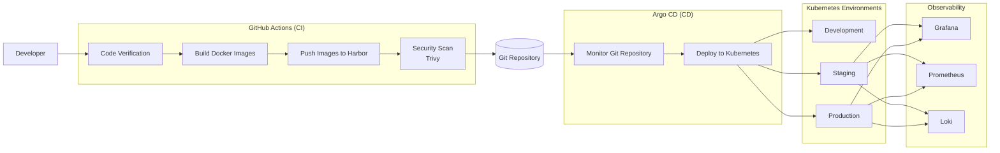

# EMC High-Level CI/CD Architecture

## Overview

The EMC deployment process follows a **GitOps-based CI/CD architecture** using **GitHub Actions** for Continuous Integration (CI) and **Argo CD** for Continuous Deployment (CD).

The workflow automates application verification, Docker image creation, security scanning, and deployment to Kubernetes.

---

## Continuous Integration (CI)

GitHub Actions is responsible for the build and validation process.

The CI pipeline performs the following tasks:

- Verify the application.
- Run Helm lint and security checks.
- Build backend and frontend Docker images.
- Push Docker images to the Harbor registry.
- Run Trivy vulnerability scans.
- Update the deployment configuration in the Git repository.

---

## Continuous Deployment (CD)

Argo CD continuously monitors the Git repository.

When a deployment configuration changes, Argo CD automatically synchronizes the Kubernetes cluster and deploys the latest application.

---

## Deployment Environments

The application is deployed to three environments:

| Environment | Purpose |
|------------|---------|
| **Development** | Developer testing and feature validation |
| **Staging** | Pre-production validation with the observability stack |
| **Production** | Stable production deployment using an approved release |

---

## Observability

The observability stack is enabled for **Staging** and **Production** environments.

It consists of:

- **Grafana** – Visualization dashboards
- **Prometheus** – Metrics collection
- **Loki** – Centralized log aggregation

These components help monitor application health, performance, and logs.

---

## Architecture Flow

1. A developer pushes code or manually starts the workflow.
2. GitHub Actions validates the application.
3. Docker images are built and pushed to Harbor.
4. Trivy scans the images for vulnerabilities.
5. GitHub Actions updates the deployment configuration in Git.
6. Argo CD detects the change.
7. Argo CD synchronizes the Kubernetes cluster.
8. The application is deployed to Development, Staging, or Production.
9. Staging and Production include the observability stack (Grafana, Prometheus, and Loki).

---

## Benefits

- Automated CI/CD pipeline.
- GitOps-based deployment using Argo CD.
- Automated Docker image build and publishing.
- Integrated Trivy vulnerability scanning.
- Automatic Kubernetes synchronization.
- Environment-specific deployments.
- Built-in observability for Staging and Production.