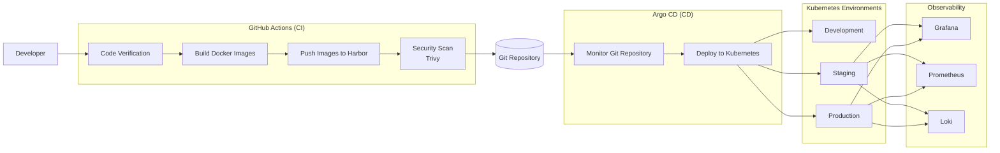

# EMC High-Level CI/CD Architecture

```mermaid
flowchart LR

    A[Developer]

    subgraph CI["GitHub Actions (CI)"]
        B[Code Verification]
        C[Build Docker Images]
        D[Push Images to Harbor]
        E[Security Scan<br/>Trivy]
    end

    F[(Git Repository)]

    subgraph CD["Argo CD (CD)"]
        G[Monitor Git Repository]
        H[Deploy to Kubernetes]
    end

    subgraph ENV["Kubernetes Environments"]
        I[Development]
        J[Staging]
        K[Production]
    end

    subgraph OBS["Observability"]
        L[Grafana]
        M[Prometheus]
        N[Loki]
    end

    A --> B
    B --> C
    C --> D
    D --> E
    E --> F

    F --> G
    G --> H

    H --> I
    H --> J
    H --> K

    J --> L
    J --> M
    J --> N

    K --> L
    K --> M
    K --> N
```