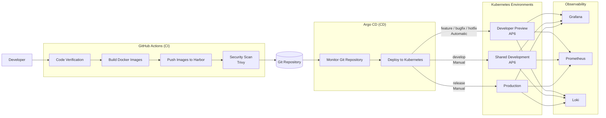

# EMC High-Level CI/CD Architecture

## Overview

The EMC deployment uses a **GitOps-based CI/CD architecture** with **GitHub Actions** for Continuous Integration (CI) and **Argo CD** for Continuous Deployment (CD).

The pipeline builds, scans, and deploys the EMC application to Kubernetes.

---

## Continuous Integration (CI)

GitHub Actions performs:

* Code verification and Helm checks.
* Backend and frontend Docker image builds.
* Push Docker images to Harbor.
* Trivy security scans.
* Use a manual image tag if provided; otherwise use the Git SHA.
* Update the Helm deployment configuration.

---

## Continuous Deployment (CD)

Argo CD deploys the application to Kubernetes using the configuration stored in Git.

Developer Preview deployments are automatic, while Shared Development and Production deployments are manually controlled.

---

## Deployment Environments

| Environment            | Branch                              | Trigger   | Purpose                      |
| ---------------------- | ----------------------------------- | --------- | ---------------------------- |
| **Developer Preview**  | `feature/*`, `bugfix/*`, `hotfix/*` | Automatic | Individual developer testing |
| **Shared Development** | `develop`                           | Manual    | Shared team testing on AP6   |
| **Production**         | `release/*`                         | Manual    | Production deployment        |

Developer Preview and Shared Development run on the **AP6 development cluster**.

---

## Observability

The environments include:

* **Grafana** – Dashboards and visualization.
* **Prometheus** – Metrics collection.
* **Loki** – Log aggregation.

Developer previews use their own namespace and preview-specific observability services.

---

## Architecture Flow

1. Developer pushes code to a developer branch or manually starts a workflow.
2. GitHub Actions verifies the application.
3. Backend and frontend Docker images are built.
4. Images are pushed to Harbor and scanned with Trivy.
5. The deployment configuration is updated in Git.
6. Argo CD deploys the application to Kubernetes.
7. `feature/*`, `bugfix/*`, and `hotfix/*` deploy automatically to Developer Preview.
8. `develop` is deployed manually to Shared Development on AP6.
9. `release/*` is deployed manually to Production.

---

## Benefits

* Automatic Developer Preview deployments.
* Manual control of Shared Development and Production.
* Isolated preview environments for developers.
* GitOps deployment with Argo CD.
* Automated Docker image build and security scanning.
* Integrated Grafana, Prometheus, and Loki observability.

## NOTICE

This work is licensed under the [CC-BY-4.0](https://creativecommons.org/licenses/by/4.0/legalcode).

- Copyright (c) 2026 ARENA2036 e.V.
- SPDX-License-Identifier: CC-BY-4.0
- SPDX-FileCopyrightText: 2026 Contributors to the Eclipse Foundation
- Source URL: https://github.com/eclipse-tractusx/edc-management-console