# User Manual

## Table of contents
-   [Getting started](#getting-started)
    -   [Accessing the app](#accessing-the-app)
        - [Login](#login)
        - [Logout](#logout)
    -   [Navigation Manage Your Connectors](#navigation-manage-your-connectors)
    -   [Skip Deploy EDC Connector steps](#skip-deploy-edc-connector-steps)
    -   [Dataspace Settings Option](#dataspace-settings-option)
    -   [SDE Option](#sde-option)

## Getting started
### Accessing the app
EMC can be accessed via a web browser.

## Login
1. Go to emc application url
    - Click on below url
    - https://emc-1-txcd.arena2036-x.de/

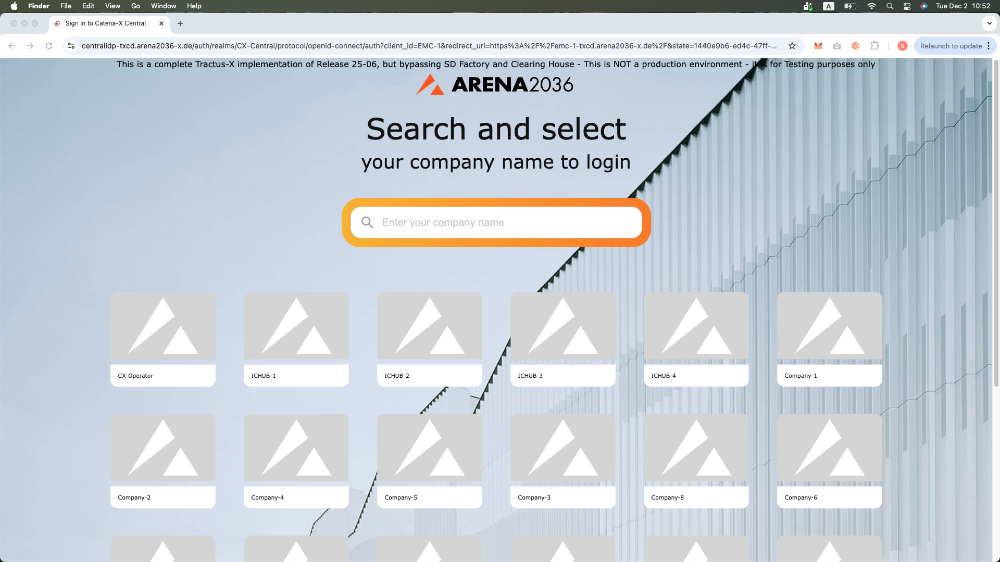

2. Select your company from the list or search by typing its name.

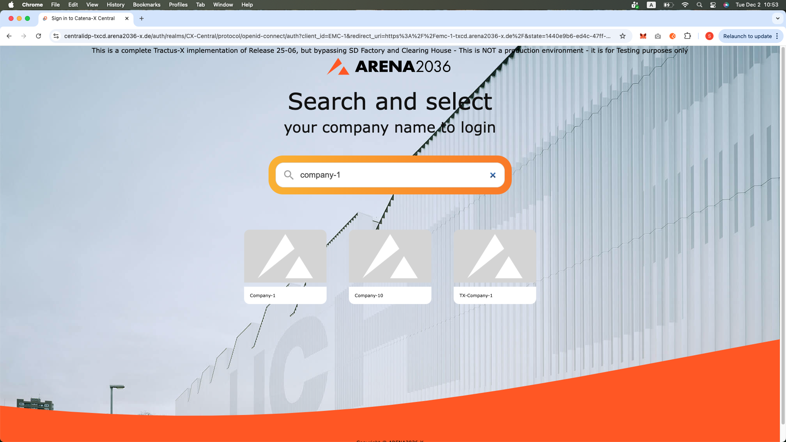

3. You will be redirected to your company's Keycloak login page.

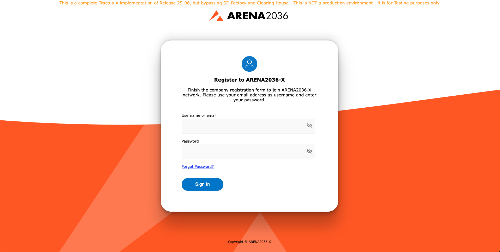

4. Enter your credentials (username/email and password).
-   Click Sign In

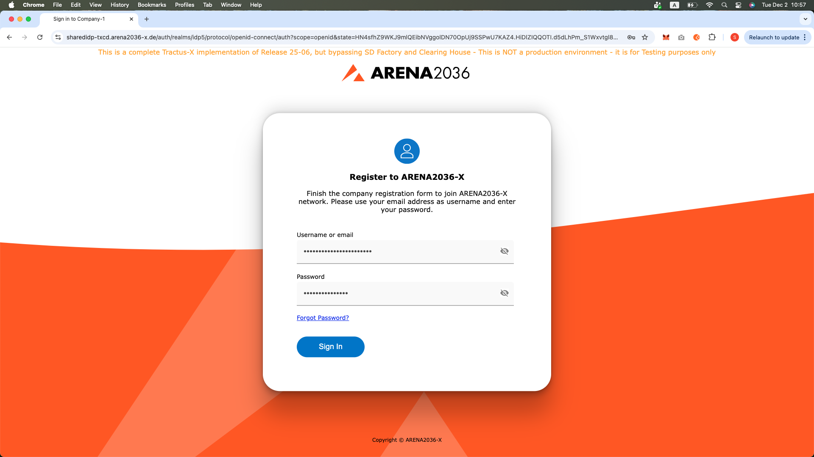

5. You will be redirected EMC dashboard.

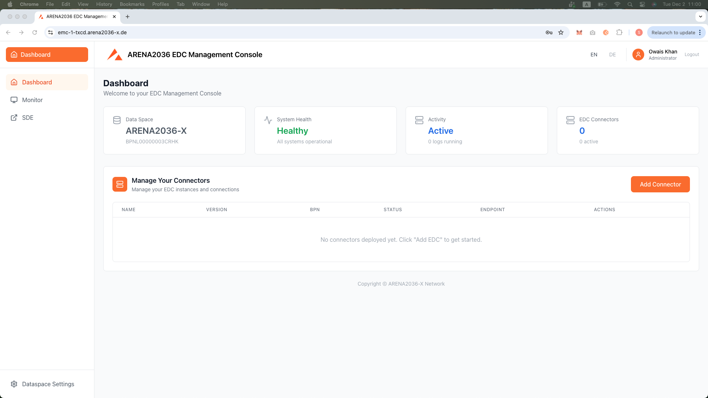

## Logout

1. In the header, click on the user icon at the top-right corner.
2. Click Logout.
3. You will be redirected back to the login page.

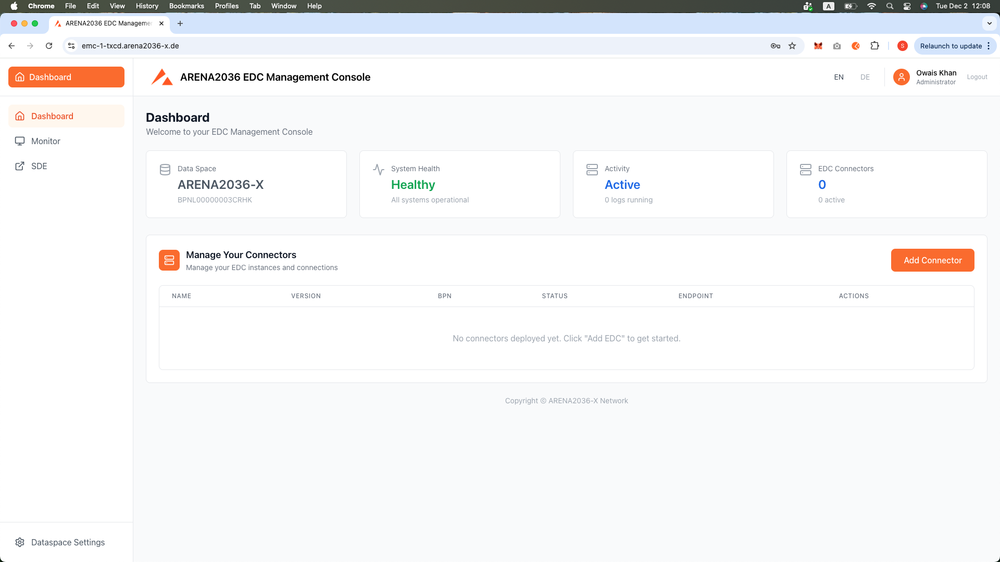

## Navigation Manage Your Connectors

You can manage and deploy EDC connectors through a guided 4‑step process.

1. Navigate to the Add Connector button
- Click Add Connector 

2. Step 1 - Deploy EDC Connector
- Enter the Service URL.
- Example format: https://new-submodel-service.arena2036-x.de
- Click Next.

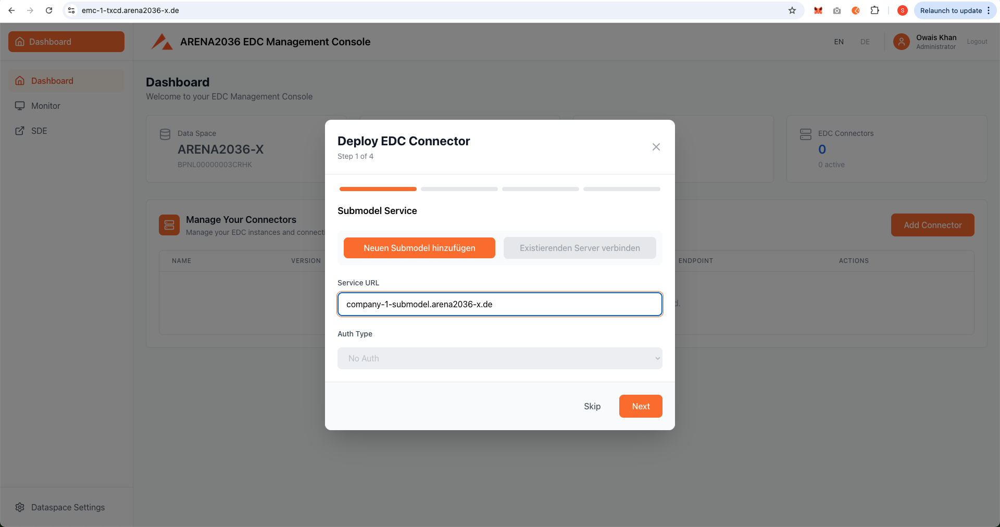

3. Step 2 - Digital Twin Registry
- Enter the Registry URL.
- Example format: registry.arena2036-x.de
- Click Next.

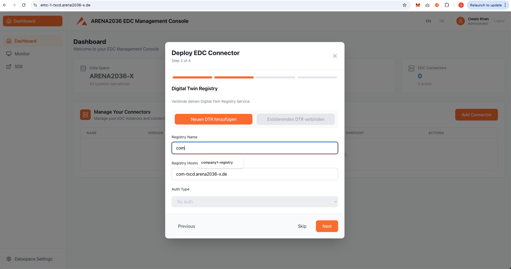

4. Step 3 - EDC Deployment Configuration
Fill in the fields shown in the screenshot:
- EDC Name
- EDC Version (Options: 0.9.0 or 0.10.2 — select one)
- Endpoint URL (automatically populated after entering the EDC Name)
- Business Partner Number (BPN)
- Username
- password
You can also preview and copy the auto‑generated YAML using the Copy YAML option.
Click Next.

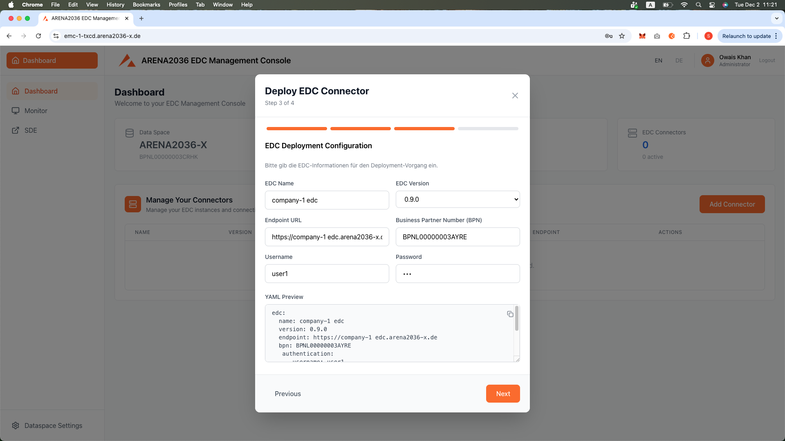

5. Step 4 - Deploy EDC Connector
- If you want to review your inputs, click Previous.
- After verifying the details, click Deploy EDC.
- Once deployed, the connector will appear under Manage Your Connectors

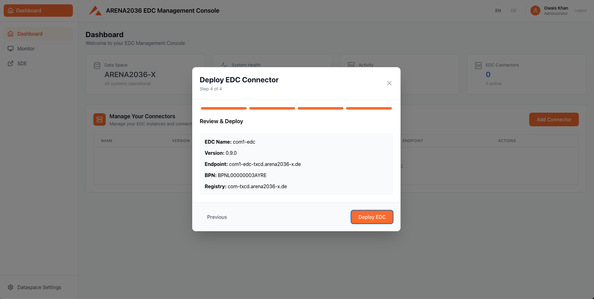

## Skip Deploy EDC Connector steps
- On the Deploy EDC Connector screen, you can click Skip to skip a step and move to the next one.

## Dataspace Settings Option

The Dataspace Settings page displays configuration values that are automatically synchronized from Keycloak.

## General Information

- Dataspace Name
Name of the dataspace environment you are operating in.
Example: ARENA2036-X

- BPN Number
The Business Partner Number associated with your organization.
Example: BPNL00000003CRHK

- Realm
The Keycloak realm under which your user and identity settings are managed.
Example: ARENA2036-X

- Username
The username of the account currently logged into EMC.
Example: user

## Identity Provider
Information about the identity provider configured for your organization.

- Central IDP URL
URL of the Central Identity Provider used for authentication.
Example:
https://centralidp-txcd.arena2036-x.de/auth/

- Portal URL
Link to the associated dataspace portal.
Example:
https://portal-txcd.arena2036-x.de

## Discovery Services

- Semantics URL
URL for the semantics service used for ontology and semantic model lookups.
Example:
https://semantics-txcd.arena2036-x.de

- Discovery Finder Endpoint
Endpoint for connector discovery within the dataspace.
Example:
/discoveryfinder/api/v1.0/administration/connectors/discovery/search

- BPN Discovery Endpoint
Endpoint for discovering connectors based on BPN.
Example:
/bpndiscovery/api/v1.0/administration/connectors/bpnDiscovery/search

## EDC Configuration

- Default EDC URL

The preconfigured default EDC Control Plane URL for your organization.
Example:
https://emc-edc-1-controlplane-txcd.arena2036-x.de

- Cluster Context
The Kubernetes cluster context used for EDC deployments and operations.
Example:
arena2036_txcd

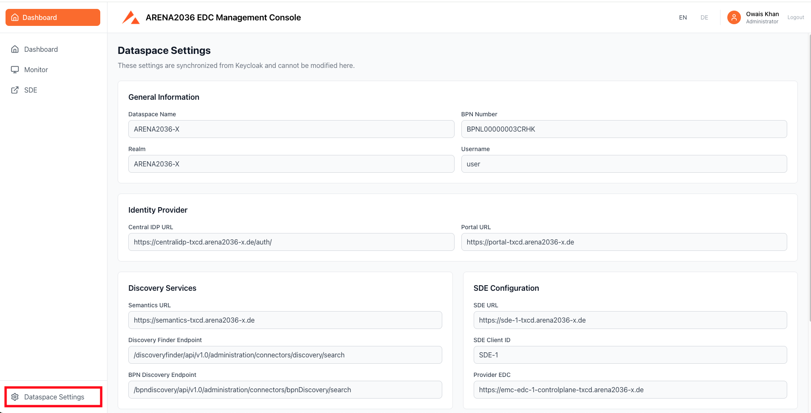

## SDE Option
When you click on the SDE option it will redirect to the Simple Data Exchanger application automatically.
If you need more information, visit the following link:

[Simple Data Exchanger User Guide](https://github.com/ARENA2036/managed-simple-data-exchanger-frontend/blob/main/docs/user-guide/README.md)

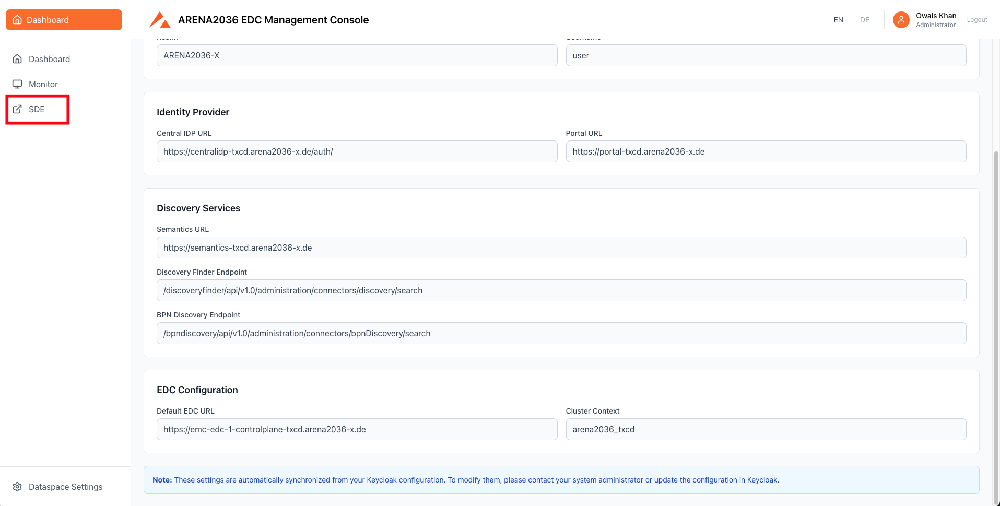