# EDC Management Console User Guide

## Overview

The EDC Management Console (EMC) is a browser-based workspace for deploying, reviewing, and managing Eclipse Dataspace Connector (EDC) instances in a Tractus-X style dataspace. It helps users create an EDC connector, attach optional services such as a Submodel Service or Digital Twin Registry, monitor the connector overview, and continue data exchange work in the Simple Data Exchanger (SDE).

The console uses Keycloak for user login and shows dataspace-specific information such as the organization BPNL, discovery services, SDE configuration, and default EDC settings.

## Contents

- [Access and Login](#access-and-login)
- [Logout](#logout)
- [Dashboard Navigation](#dashboard-navigation)
- [Deploy an EDC Connector](#deploy-an-edc-connector)
- [Add Components and Services](#add-components-and-services)
- [Connector and Component Status](#connector-and-component-status)
- [Dataspace Settings](#dataspace-settings)
- [SDE Integration](#sde-integration)
- [Short API Reference](#short-api-reference)
- [Known Issues](#known-issues)

## Access and Login

Open the EMC application URL in your browser. In a workshop or hosted environment, this URL is usually provided by the platform or workshop team.

On the company selection page, search for your company or tenant and select it. EMC then redirects you to the configured Keycloak login page for that organization.

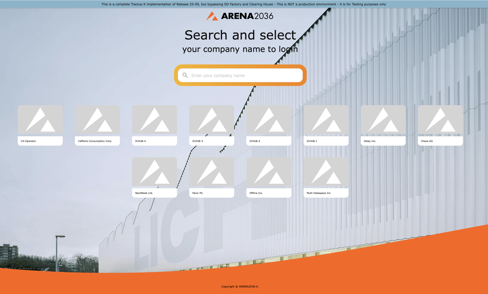

Enter your username or email address and password in Keycloak.

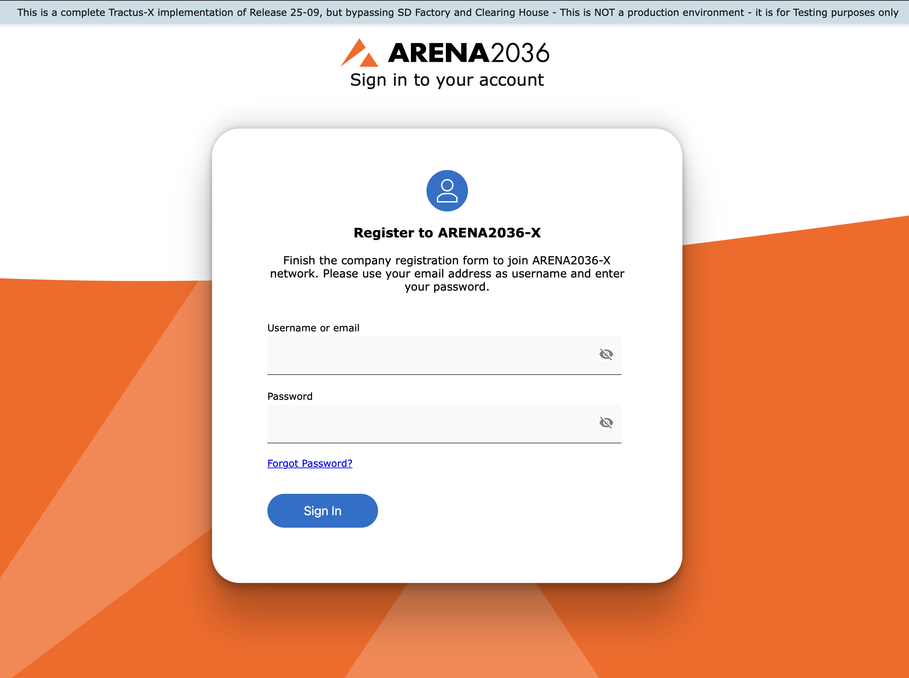

After a successful login, you are redirected to the EMC dashboard.

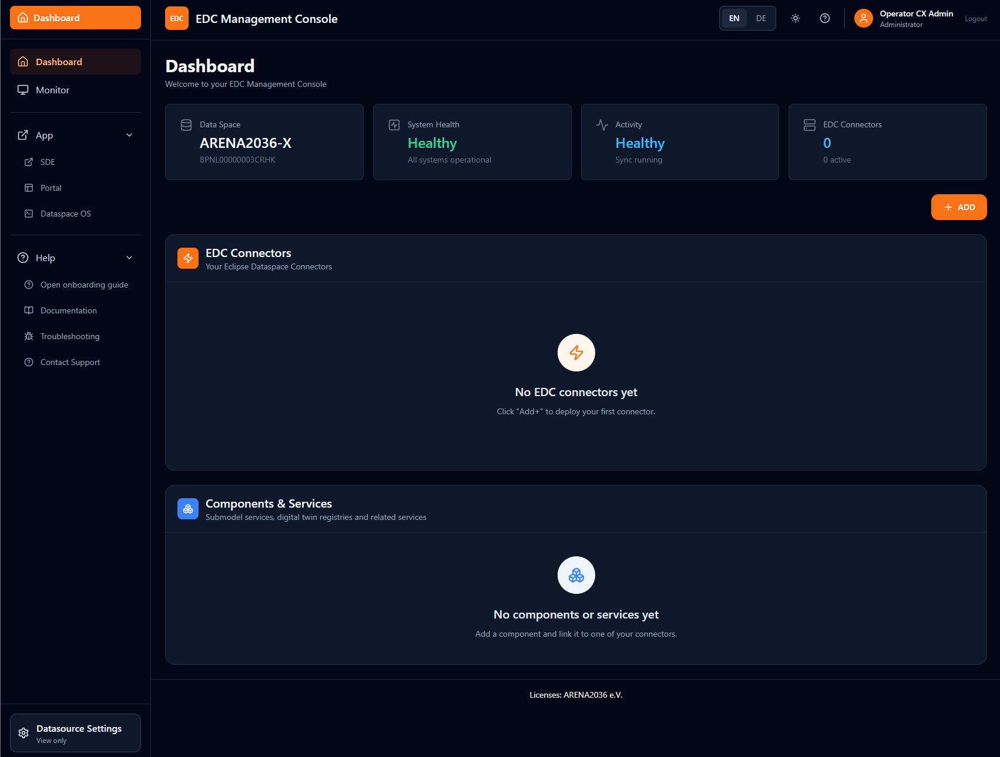

## Logout

1. Use the logout action in the header at the top right of the application. 

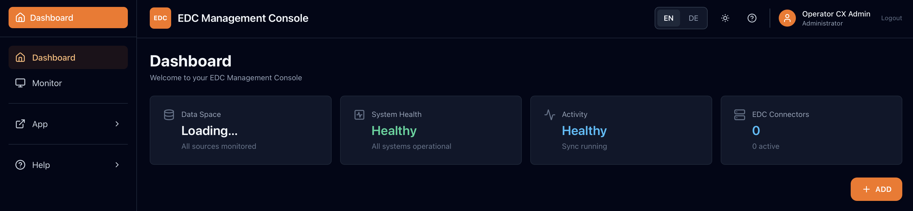

2. After logout, the Keycloak session is ended or you are redirected back to the login flow, depending on the environment configuration.

## Dashboard Navigation

The dashboard is the main workspace for the console. It contains summary cards, connector management, component management, and navigation to companion applications.

The main dashboard cards are:

- Data Space: shows the loaded dataspace name and BPNL.
- System Health: gives a high-level health indication for the console environment.
- Activity: shows whether recent activity or synchronization is available.
- EDC Connectors: shows how many connectors are known and how many are active.

The sidebar contains these main areas:

- Dashboard: connector and component overview.
- Monitor: operational and status-oriented view.
- App: links to SDE, Portal, and Dataspace OS entries.
- Help: onboarding guide, documentation, troubleshooting, and support links.
- Datasource Settings: read-only dataspace and integration settings.

## Deploy an EDC Connector

From the dashboard, click `ADD`. EMC asks whether you want to deploy an `EDC Connector` or add a `Component / Service`.

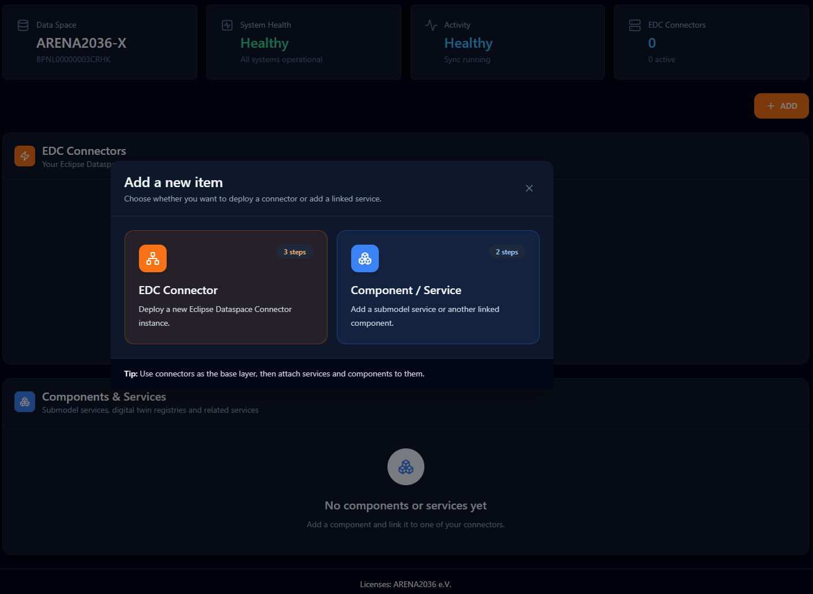

Choose `EDC Connector` when you want to deploy a new data exchange connector instance.

### Connector Details

Enter the base connector information:

- Connector name: the name for the EDC instance.
- BPNL: the Business Partner Number for your organization. In some environments this is prefilled from Keycloak or dataspace settings.
- Version: select the connector version offered by your environment.

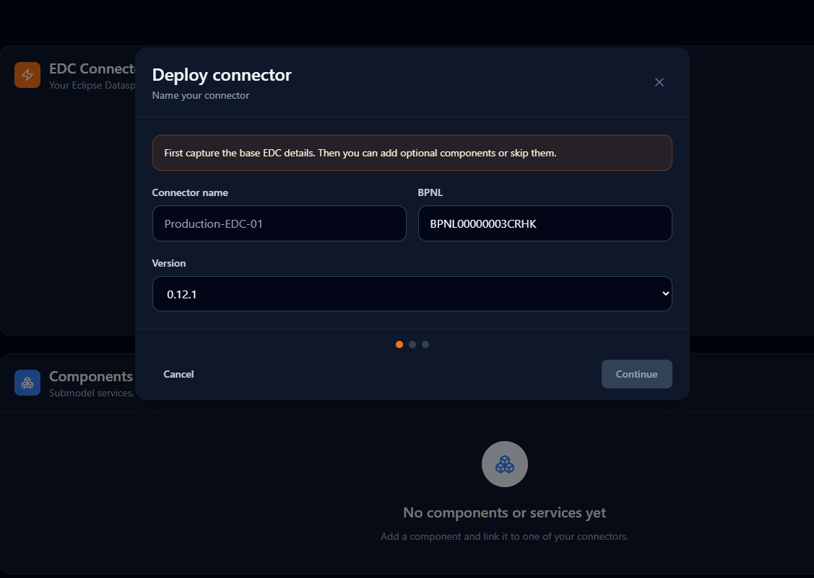

Use the BPNL provided by your onboarding, workshop, or platform team. The BPNL is used to identify the organization in dataspace interactions.

The Word document also shows component-oriented screens for Submodel Service and Digital Twin Registry configuration. These fields may appear in environments where the connector wizard includes optional service steps.

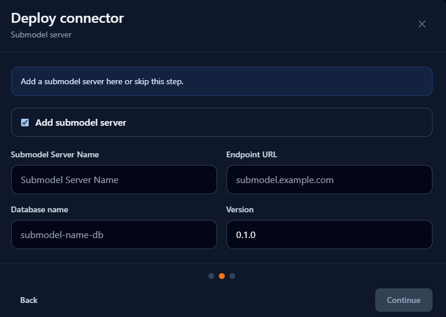

You can either complete the Submodel Server Server or Skip this step.

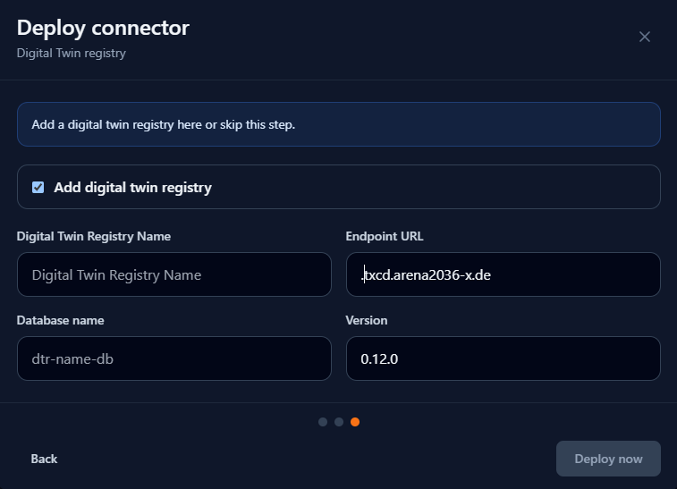

### Endpoints

Enter the connector endpoints requested by the wizard:

- API or control-plane endpoint.
- Data-plane endpoint.

These values usually come from the platform team, Kubernetes or ingress configuration, or existing operations documentation.

After entering the required values, deploy the connector. If you also want to add a Submodel Service or Digital Twin Registry directly afterwards, choose the deploy-and-add-component option when available.

## Add Components and Services

Components are attached to an existing EDC connector. EMC currently supports these component types in the user interface:

- Submodel Service: used for asset or submodel data.
- Digital Twin Registry: used for digital twin registration and lookup functions.

You can start this flow in two ways:

- Click `ADD`, then choose `Component / Service`.
- Use the add-component action from an existing connector row.

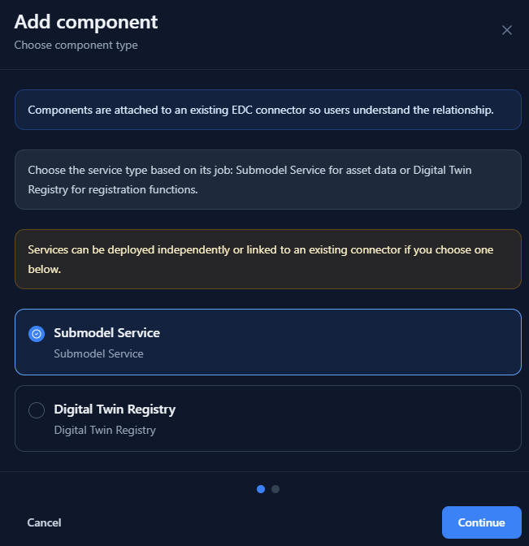

The component wizard asks for:

- Component type.
- Component name.
- Linked connector.
- Service mode.
- Existing service URL and optional credentials, when connecting an already running service.

Use `Deploy new` when the service should be registered as a new component in the dashboard. Use `Connect existing` when the service already exists and you only want to link it to the connector.

## Connector and Component Status

After deployment, the dashboard lists connectors in the `EDC Connectors` table and linked services in the `Components & Services` table.

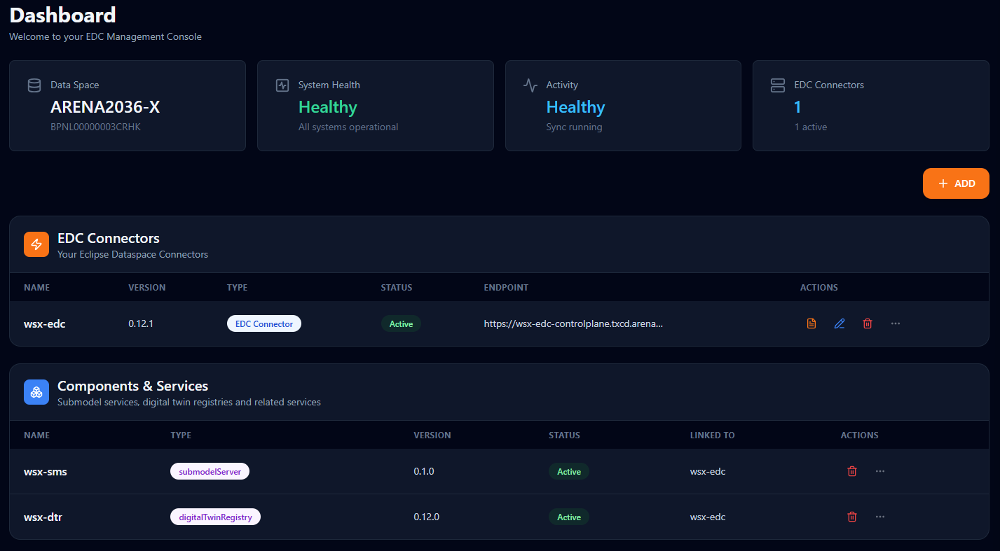

Connector rows show:

- Name.
- Version.
- Type.
- Status.
- Endpoint.
- Actions such as YAML/details, add component, and delete.

Component rows show:

- Name.
- Type.
- Version.
- Status.
- Linked connector.
- Actions such as details and delete.

Status behavior depends on the current backend and frontend wiring:

- Backend connector health is based on EDC health checks and may update connectors as `healthy` or `unhealthy`.
- The frontend presents user-facing labels such as `Active`, `Healthy`, `Connected`, or `Disconnected` depending on the view and data source.
- A newly deployed connector may appear before every backend health check has completed.
- If a connector is deleted, linked components are also removed from the dashboard overview so the UI does not keep broken references.

## Dataspace Settings

The Dataspace Settings page is read-only. It displays platform and dataspace values loaded from backend configuration.

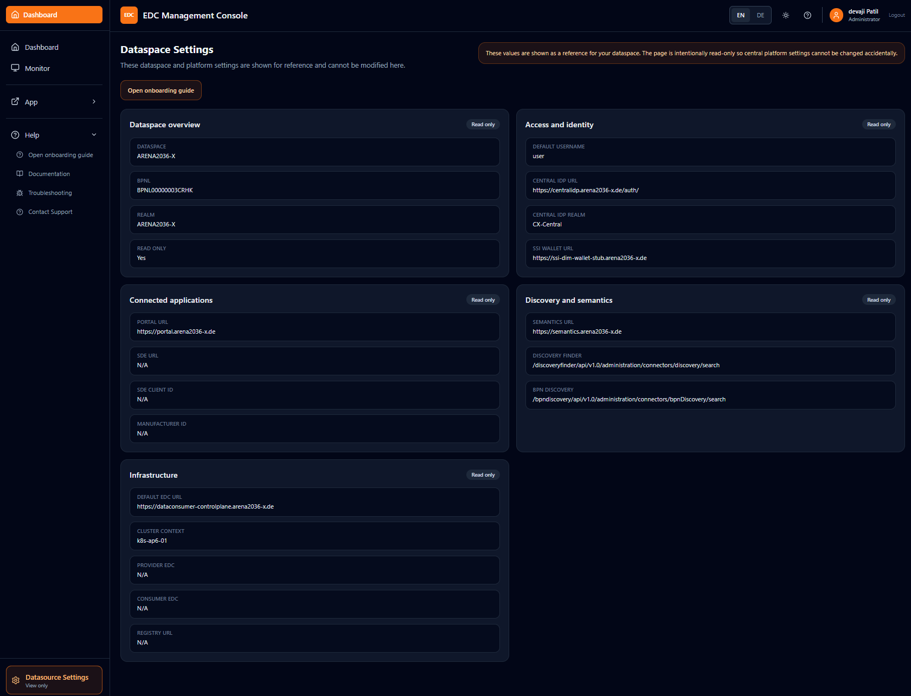
The settings are grouped as:

- Dataspace overview: dataspace name, BPNL, realm, and read-only state.
- Access and identity: default username, Central IDP URL, Central IDP realm, and SSI wallet URL.
- Connected applications: Portal URL, SDE URL, SDE client ID, and manufacturer ID.
- Discovery and semantics: semantics URL, discovery finder endpoint, and BPN discovery endpoint.
- Infrastructure: default EDC URL, cluster context, provider EDC, consumer EDC, and registry URL.

These values are intended as reference information for users. They should be changed in the central platform or deployment configuration, not directly in the console.

## SDE Integration

The SDE URL is read from runtime configuration or from the backend dataspace settings. If the SDE page does not open, check whether an SDE URL is configured for the environment.

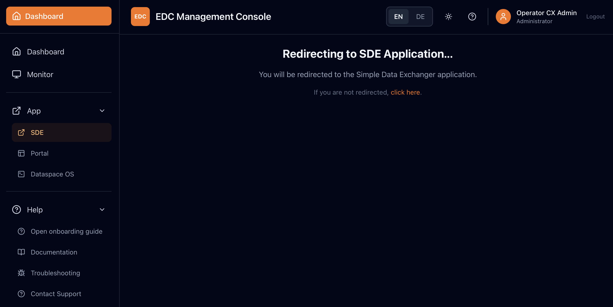

## Short API Reference

The frontend primarily uses these backend endpoints:

- `GET /health`: backend health check.
- `GET /api/connectors`: list known connectors.
- `POST /api/connector`: create or deploy a connector.
- `GET /api/connectors/{id}`: get one connector.
- `PUT /api/connectors/{id}`: update or upgrade a connector.
- `DELETE /api/connectors/{name}`: delete a connector by name.
- `GET /api/config`: read application settings.
- `GET /api/dataspace`: read dataspace settings for the UI.
- `GET /api/logs?limit=50`: intended activity log endpoint, if enabled by the backend.

Some endpoints are protected by API key authentication, while others expect a Keycloak bearer token. See the known issues section for the current mismatch.

## Known Issues

- Some screenshots in older versions of the guide showed a four-step connector wizard. The current application separates EDC connector deployment from optional component/service setup.
- The backend initialization must run during FastAPI startup. Starting the app by importing `init:app` may skip manager initialization unless the startup wiring is fixed.
- Authentication is currently mixed: some backend routes use `X-Api-Key`, while other routes use Keycloak bearer tokens.
- Swagger Keycloak OAuth integration is present as a placeholder and needs full configuration.
- The frontend calls an activity log endpoint, but the backend route may be disabled.
- Some UI labels use `Datasource Settings`, while the documentation and backend use `Dataspace Settings`.
